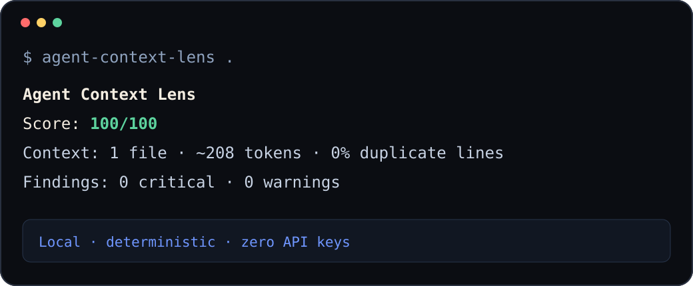

# Agent Context Lens

> Lighthouse for the context your coding agents actually consume.

[](https://github.com/ciceroyang/agent-context-lens/actions/workflows/ci.yml)
[](https://www.python.org/)
[](LICENSE)

Coding agents quietly accumulate `AGENTS.md`, Claude instructions, editor
rules, skills, and MCP configuration. That context behaves like a dependency:
it can grow, conflict, break, or expose secrets without a normal code review.

Agent Context Lens maps that dependency locally. Its scan mode gives you a
deterministic scorecard, and its Codex explain mode reconstructs a declared
project-instruction chain while keeping modeled uncertainty visible.



## Quick start

Install the current release directly from GitHub:

```bash
python -m pip install "git+https://github.com/ciceroyang/agent-context-lens.git"
```

Scan a repository:

```bash
agent-context-lens /path/to/repository
```

Explain the Codex project instructions for a working directory:

```bash
agent-context-lens /path/to/repository \
  --explain --agent codex \
  --cwd /path/to/repository/services/payments \
  --project-root /path/to/repository
```

Python 3.10 or later is required. The scan reads only recognized context and MCP
configuration files. It makes no network requests or model calls.

Explain mode is also local and deterministic. It does not run Codex, parse
Codex TOML, call a model, or inspect user-global instructions unless you pass
`--include-user`.

## Codex context explain

Codex instructions are layered from the project root down to the selected
working directory. Same-directory overrides, fallback filenames, empty files,
byte limits, symlinks, configuration provenance, CLI versions, and platforms
can all change what is visible.

Explain mode separates three evidence classes:

- `official_contract` for behavior stated by current official Codex
  documentation without a known conflict;
- `versioned_observation` for an exact named CLI-version and platform profile;
- `unknown` when documentation, configuration, version, platform, encoding, or
  filesystem behavior is unresolved.

The default `official-contract` profile does not guess at disputed empty-file,
separator, partial-prefix, or invalid-UTF-8 boundaries. It reports structured
limitations instead.

Run the checked-in synthetic monorepo example:

```bash
agent-context-lens demo/monorepo \
  --explain --agent codex \
  --cwd demo/monorepo/services/payments \
  --project-root demo/monorepo
```

The result shows:

- active root-to-working-directory sources in load order;
- shadowed, outside-chain, partial, unknown, and unsupported sources;
- raw source bytes, raw loaded-prefix bytes, rendered UTF-8 bytes, separators,
  hashes, and encoding state;
- project and user instruction-scope status;
- configuration, version, platform, and safe-mode limitations.

Use JSON or Markdown without changing the underlying state:

```bash
agent-context-lens . --explain --agent codex --format json
agent-context-lens . --explain --agent codex --format markdown
```

To compare against an accepted, exact evidence profile, declare both the
profile and its matching version:

```bash
agent-context-lens . --explain --agent codex \
  --codex-version 0.145.0 \
  --behavior-profile codex-cli-0.145.0-darwin-arm64
```

The named profiles are deliberately version- and platform-bound. They do not
claim whole-prompt parity, future-version behavior, or support on an untested
operating system.

### Declared configuration

Explain mode accepts direct declarations:

```text
--project-root PATH
--root-marker NAME
--fallback-name NAME
--max-bytes N
--project-trust trusted|untrusted|unknown
--codex-version VERSION
--behavior-profile PROFILE_ID
```

Or pass a normalized JSON snapshot with `--config-snapshot`. Direct flags take
precedence over matching snapshot values and appear in provenance.

Agent Context Lens does not parse `.codex/config.toml`. Python 3.10 has no
standard-library TOML parser, and a partial parser would be unsafe around
profiles and configuration precedence. If relevant TOML exists but the
effective values are not declared, the report shows
`toml_config_not_parsed`.

### Privacy and symlinks

- User-global instructions are excluded by default and reported as
  `user_scope_not_requested`.
- Without `--include-user`, explain mode does not open, stat, hash, or
  content-read `CODEX_HOME/AGENTS.override.md` or `CODEX_HOME/AGENTS.md`.
- With `--include-user`, displayed user paths are redacted to
  `$CODEX_HOME/...`.
- Instruction-file, path-directory, and `CODEX_HOME` symlinks are refused in
  safe mode. Target contents are not read.
- Reports contain metadata and hashes, not instruction contents.

## Who this is for

Use Agent Context Lens when you:

- maintain a repository with more than one coding-agent instruction surface;
- add Cursor, Claude, Copilot, Windsurf, skill, or MCP configuration;
- want a deterministic context check before CI or code review;
- need to find duplicate instructions, unsafe MCP configuration, or missing
  verification guidance.

Run it on a real repository, then
[share your score or a missing path](https://github.com/ciceroyang/agent-context-lens/discussions/1).
Please remove secrets, private paths, and proprietary instructions first.

## Why this exists

- **Local by default.** Repository context never leaves your machine.
- **Zero API keys.** The audit is deterministic and makes no model calls.
- **Cross-agent.** It understands common Codex, Claude Code, Cursor, Windsurf,
  Copilot, skill, and MCP paths.
- **CI-ready.** JSON and Markdown output plus a score threshold make drift
  reviewable.
- **Security-aware.** It flags likely inline secrets and broad shell modes in MCP
  configuration.

## Editable development install

Clone the repository and install the development environment:

```bash
git clone https://github.com/ciceroyang/agent-context-lens.git
cd agent-context-lens
python -m pip install -e ".[dev]"
```

## What it scans

Agent Context Lens intentionally avoids reading arbitrary source code. It only
opens recognized agent-context and MCP configuration files:

| Surface | Recognized paths |
|---|---|
| Repository instructions | `AGENTS.md`, nested `AGENTS.md`, `CLAUDE.md` |
| Editor agents | `.cursor/rules/*.mdc`, `.windsurf/rules/*.md` |
| Copilot | `.github/copilot-instructions.md` |
| Portable skills | nested `SKILL.md` files |
| MCP | `.mcp.json`, `mcp.json`, `.cursor/mcp.json`, `.vscode/mcp.json` |

## Reports

Human-readable terminal output is the default:

```bash
agent-context-lens .
```

Create a review artifact:

```bash
agent-context-lens . --format markdown --output agent-context-report.md
```

Feed structured data to another tool:

```bash
agent-context-lens . --format json --output agent-context-report.json
```

Block context regressions in CI:

```bash
agent-context-lens . --fail-under 80
```

The command returns exit status `2` when the score is below the threshold.

## Current checks

- missing repository-level agent instructions;
- approximate context size per file and for the repository;
- repeated substantial instruction lines;
- missing concrete verification or test commands;
- broken local links in Markdown context;
- possible inline secrets in MCP configuration;
- broad shell and dangerous-mode MCP commands.

All findings include stable codes so CI integrations do not have to parse prose.

## Scoring

Every scan starts at 100.

- Critical finding: −25
- Warning: −8
- Notice: −2

The score is deliberately simple. It is a fast review signal, not a claim that
one number can measure agent quality.

## Roadmap

- [x] Bounded Codex project-instruction explain mode
- [ ] Effective context diff mode
- [ ] Contradictory instruction detection with explainable evidence
- [ ] SARIF output for GitHub code scanning
- [ ] Provider-specific MCP permission checks
- [ ] Baseline files for gradual CI adoption
- [ ] Tokenizers as optional extras while keeping the default dependency-free

Have a real context failure that this misses? Please open an issue with a minimal
reproduction or use the
[missing context path form](https://github.com/ciceroyang/agent-context-lens/issues/new?template=missing_context_path.yml).
Failure cases will drive the rules.

## Development

```bash
python -m pip install -e ".[dev]"
python -m pytest
agent-context-lens . --fail-under 80
```

Runtime code has no third-party dependencies.

See [CONTRIBUTING.md](CONTRIBUTING.md) for focused changes and verification
requirements. Report vulnerabilities through the private process in
[SECURITY.md](SECURITY.md).

## License

[MIT](LICENSE)
